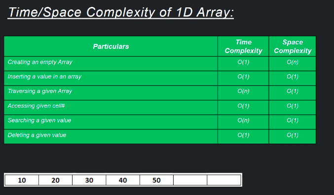

<h2>Array:</h2>
is a datastructure consisting of the collection of simiar data type elements each identified by array index. An array is stored
such that the position of each element can be computed from its indec cell by a mathematical formulae. What that means is that
if you have an array then u can find the number in array from the first index.

  
<b>e.g. of Array :</b> Array of Integer with size 9 
<table>
  <tr>
    <td>
           12
    </td>
     <td>
           2
    </td>
     <td>
           5
    </td>  
    <td>
           67
    </td>
    <td>
          452
    </td>
     <td>
           95
    </td>   
    <td>
           56
    </td>
    <td>
           7
    </td>
     <td>
           36
    </td>    
  </tr>
</table>

  
<b>e.g. of Array :</b> Array of char with size 5
<table>
  <tr>
    <td>
           'g'
    </td>
     <td>
           'q'
    </td>
     <td>
           'y'
    </td>  
    <td>
           'p'
    </td>
    <td>
          'd'
    </td>
  </tr>
</table>

  
<b>Properties of an array :</b>
  - every cell of an array has a unique index
  - index starts with 0
  - array can store data of specified data type i.e. if its an integer array one cannot store char or String or 
  any other data type.
  - It has contiguous memory location
  - Size of an array needs to be mandatorily specified and cannot be modified. Once you are creating an array u have to define
  the size of an array. Once the array is created u cannot increase or decrease the size if of an array.Thats one of the 
  limitaion of an array.
  
    
   <h2> Why do we need an Aray </h2>
  
Lets say we have a problem where we have to store 1 million records of same data type. So one solution is to created 1     
  million records or variables with the same data type. 
  Now what is the problem with above solution : it will be really hard to maintain it.also we need to remember the name of all 
  million records.

  
So Array come in picture where we can store data with the same data type and it is in maintaining and retriving or 
  computing on any given records. 

  
    
  <b>Types of Array : </b>
  - One dimensionsal : is the one which has one row and has multiple columns.
  - Multidimensional array : is the one which has `more than one rows or multiple rows` and multiple columns.
    Multidimesional array can be :
      - two dimensional array
      - three dimensional array
      - four dimensional array
      - n dimensional array
    
(Java supports upto 255 dimensional array). 

    
In java we mainly use more one and two dimensional arrays.

    
    
 
<b>e.g. of One dimensional Array :</b> 
<table>
  <tr>
    <td>
           12
    </td>
     <td>
           2
    </td>
     <td>
           5
    </td>  
    <td>
           67
    </td>
    <td>
          452
    </td>
     <td>
           95
    </td>   
    <td>
           56
    </td>
    <td>
           7
    </td>
     <td>
           36
    </td>    
  </tr>
</table>

 
<b>e.g. of Multidimensional dimensional Array(two dimensional array) :</b> 
<table>
  <tr>
    <td>
           12
    </td>
     <td>
           2
    </td>
     <td>
           5
    </td>  
    <td>
           67
    </td>
    <td>
          452
    </td>
     <td>
           5
    </td>   
    <td>
           46
    </td>
    <td>
           27
    </td>
     <td>
           9
    </td>    
  </tr>
  <tr>
    <td>
           26
    </td>
     <td>
           45
    </td>
     <td>
           84
    </td>  
    <td>
           56
    </td>
    <td>
          75
    </td>
     <td>
           976
    </td>   
    <td>
           65
    </td>
    <td>
           24
    </td>
     <td>
           624
    </td>    
  </tr>
   <tr>
    <td>
           351
    </td>
     <td>
           53
    </td>
     <td>
           451
    </td>  
    <td>
           246
    </td>
    <td>
          1
    </td>
     <td>
           95
    </td>   
    <td>
           4125
    </td>
    <td>
           254
    </td>
     <td>
           543
    </td>    
  </tr>
</table>

  
<h3> Memory management of array </h3>
  
Lets say this is the memory before array got created
    <table>
      <tr>
      <td></td><td></td><td></td><td></td><td></td><td></td><td></td><td></td><td></td><td></td><td></td><td></td><td></td> 
      </tr>
      <tr>
      <td></td><td></td><td></td><td></td><td></td><td></td><td></td><td></td><td></td><td></td><td></td><td></td><td></td> 
      </tr>
      <tr>
      <td></td><td></td><td></td><td></td><td></td><td></td><td></td><td></td><td></td><td></td><td></td><td></td><td></td> 
      </tr>
      <tr>
      <td></td><td></td><td></td><td></td><td></td><td></td><td></td><td></td><td></td><td></td><td></td><td></td><td></td> 
      </tr>
      <tr>
      <td></td><td></td><td></td><td></td><td></td><td></td><td></td><td></td><td></td><td></td><td></td><td></td><td></td> 
      </tr>
    </table>
  
  
     
  <h3> a. Single Dimension Array :</h3> 
      
  <b>(i)Declaration  </b>
  
      int[] arry;
      
      Once an array is declared the compiler do not allocate any memory, it only creates a reference in this case the 
      reference is `arry`.
  
  
  
<b> Memory after array declaration:</b>

<table>
      <tr>
      <td></td><td></td><td></td><td></td><td></td><td></td><td></td><td></td><td></td><td></td><td></td><td></td><td></td> 
      </tr>
      <tr>
      <td></td><td></td><td></td><td></td><td></td><td></td><td></td><td></td><td></td><td></td><td></td><td></td><td></td> 
      </tr>
      <tr>
      <td></td><td></td><td></td><td></td><td></td><td></td><td></td><td></td><td></td><td></td><td></td><td></td><td></td> 
      </tr>
      <tr>
      <td></td><td></td><td></td><td></td><td></td><td></td><td></td><td></td><td></td><td></td><td></td><td></td><td></td> 
      </tr>
      <tr>
      <td></td><td></td><td></td><td></td><td></td><td></td><td></td><td></td><td></td><td></td><td></td><td></td><td></td> 
      </tr>
    </table>

     

  <b>(ii)Creating or instantiating an array </b>
      
      int [] arry =  new int[4];
      
      Once an array is created the compiler do allocate the total size of an array in memory at any place and it is conitnues,
      since the array size is 4, compiler will allocate 4 memory cells to the array and will by default place 0 as the value.
      Also it will get the memory address of the first cell of an array and allocate it to the reference variable i.e. arry.
      Lets say the memory address of the first cell is 111 so it will store the address to the reference variable i.e. `arry`.
      
 
 
 <b>Memory after creating or instantiating an array: </b>
  
  <table>
      <tr>
      <td></td><td></td><td></td><td></td><td></td><td></td><td></td><td></td><td></td><td></td><td></td><td></td><td></td> 
      </tr>
      <tr>
      <td></td><td></td><td></td><td></td><td></td><td></td><td></td><td></td><td></td><td>0</td><td>0</td><td>0</td><td>0</td> 
      </tr>
      <tr>
      <td></td><td></td><td></td><td></td><td></td><td></td><td></td><td></td><td></td><td></td><td></td><td></td><td></td> 
      </tr>
      <tr>
      <td></td><td></td><td></td><td></td><td></td><td></td><td></td><td></td><td></td><td></td><td></td><td></td><td></td> 
      </tr>
      <tr>
      <td></td><td></td><td></td><td></td><td></td><td></td><td></td><td></td><td></td><td></td><td></td><td></td><td></td> 
      </tr>
    </table>

   
        
    
  <b>(iii)initialization an array </b>
  
      arry[0] = 2;
      arry[1] = 35;
      arry[2] = 5;
      arry[3] = 54;

 <b>Memory after initializating values in an array: </b>
  
  <table>
      <tr>
      <td></td><td></td><td></td><td></td><td></td><td></td><td></td><td></td><td></td><td></td><td></td><td></td><td></td> 
      </tr>
      <tr>
      <td></td><td></td><td></td><td></td><td></td><td></td><td></td><td></td><td></td><td>2</td><td>35</td><td>5</td><td>54</td> 
      </tr>
      <tr>
      <td></td><td></td><td></td><td></td><td></td><td></td><td></td><td></td><td></td><td></td><td></td><td></td><td></td> 
      </tr>
      <tr>
      <td></td><td></td><td></td><td></td><td></td><td></td><td></td><td></td><td></td><td></td><td></td><td></td><td></td> 
      </tr>
      <tr>
      <td></td><td></td><td></td><td></td><td></td><td></td><td></td><td></td><td></td><td></td><td></td><td></td><td></td> 
      </tr>
    </table>

  
<b>Another way of creating array</b>

      int[] arry = {0,3,3,5}

<table>
      <tr>
      <td></td><td></td><td></td><td></td><td></td><td></td><td></td><td></td><td></td><td></td><td></td><td></td><td></td> 
      </tr>
      <tr>
      <td></td><td></td><td></td><td></td><td></td><td></td><td></td><td></td><td></td><td>0</td><td>3</td><td>3</td><td>5</td> 
      </tr>
      <tr>
      <td></td><td></td><td></td><td></td><td></td><td></td><td></td><td></td><td></td><td></td><td></td><td></td><td></td> 
      </tr>
      <tr>
      <td></td><td></td><td></td><td></td><td></td><td></td><td></td><td></td><td></td><td></td><td></td><td></td><td></td> 
      </tr>
      <tr>
      <td></td><td></td><td></td><td></td><td></td><td></td><td></td><td></td><td></td><td></td><td></td><td></td><td></td> 
      </tr>
    </table>

  
 <h3> b. Two Dimensional Array (is same like single dimensional array :</h3> 
 
   <b>(i)Declaration  </b>
  
      int[][] arry;
      
      Once an array is declared the compiler do not allocate any memory, it only creates a reference in this case the 
      reference is `arry`.
  
  
  
<b> Memory after array declaration:</b>

<table>
      <tr>
      <td></td><td></td><td></td><td></td><td></td><td></td><td></td><td></td><td></td><td></td><td></td><td></td><td></td> 
      </tr>
      <tr>
      <td></td><td></td><td></td><td></td><td></td><td></td><td></td><td></td><td></td><td></td><td></td><td></td><td></td> 
      </tr>
      <tr>
      <td></td><td></td><td></td><td></td><td></td><td></td><td></td><td></td><td></td><td></td><td></td><td></td><td></td> 
      </tr>
      <tr>
      <td></td><td></td><td></td><td></td><td></td><td></td><td></td><td></td><td></td><td></td><td></td><td></td><td></td> 
      </tr>
      <tr>
      <td></td><td></td><td></td><td></td><td></td><td></td><td></td><td></td><td></td><td></td><td></td><td></td><td></td> 
      </tr>
    </table>

     

  <b>(ii)Creating or instantiating an array </b>
      
      int [][] arry =  new int[2][3];
      
      Once an array is created the compiler do allocate the total size of an array in memory at any place and it is conitnues,
      since the array size is 4, compiler will allocate 4 memory cells to the array and will by default place 0 as the value.
      Also it will get the memory address of the first cell of an array and allocate it to the reference variable i.e. arry.
      Lets say the memory address of the first cell is 111 so it will store the address to the reference variable i.e. `arry`.
      
 
 
 <b>Memory after creating or instantiating an array: </b>
  
  <table>
      <tr>
      <td></td><td></td><td></td><td></td><td></td><td></td><td></td><td></td><td></td><td></td><td></td><td></td><td></td> 
      </tr>
      <tr>
      <td></td><td></td><td></td><td></td><td></td><td></td><td></td><td>0</td><td>0</td><td>0</td><td>0</td><td>0</td><td>0</td> 
      </tr>
      <tr>
      <td></td><td></td><td></td><td></td><td></td><td></td><td></td><td></td><td></td><td></td><td></td><td></td><td></td> 
      </tr>
      <tr>
      <td></td><td></td><td></td><td></td><td></td><td></td><td></td><td></td><td></td><td></td><td></td><td></td><td></td> 
      </tr>
      <tr>
      <td></td><td></td><td></td><td></td><td></td><td></td><td></td><td></td><td></td><td></td><td></td><td></td><td></td> 
      </tr>
    </table>

   
        
    
  <b> initialization an array </b>
  
      arry[0][0] = 2;
      arry[0][1] = 35;
      arry[0][2] = 73;
      arry[1][0] = 77; 
      arry[1][1] = 54;
      arry[1][2] = 74;

 <b>Memory after initializating values in an array: </b>
  
  <table>
      <tr>
      <td></td><td></td><td></td><td></td><td></td><td></td><td></td><td></td><td></td><td></td><td></td><td></td><td></td> 
      </tr>
      <tr>
      <td></td><td></td><td></td><td></td><td></td><td></td><td></td><td>2</td><td>35</td><td>5</td><td>77</td><td>54</td><td>74</td> 
      </tr>
      <tr>
      <td></td><td></td><td></td><td></td><td></td><td></td><td></td><td></td><td></td><td></td><td></td><td></td><td></td> 
      </tr>
      <tr>
      <td></td><td></td><td></td><td></td><td></td><td></td><td></td><td></td><td></td><td></td><td></td><td></td><td></td> 
      </tr>
      <tr>
      <td></td><td></td><td></td><td></td><td></td><td></td><td></td><td></td><td></td><td></td><td></td><td></td><td></td> 
      </tr>
    </table>

  
<b>Another way of creating array</b>

      int[] arry = {{2,3,5},{64,85,12}};

<table>
      <tr>
      <td></td><td></td><td></td><td></td><td></td><td></td><td></td><td></td><td></td><td></td><td></td><td></td><td></td> 
      </tr>
      <tr>
      <td></td><td></td><td></td><td></td><td></td><td></td><td></td><td>2</td><td>3</td><td>5</td><td>64</td><td>85</td><td>12</td> 
      </tr>
      <tr>
      <td></td><td></td><td></td><td></td><td></td><td></td><td></td><td></td><td></td><td></td><td></td><td></td><td></td> 
      </tr>
      <tr>
      <td></td><td></td><td></td><td></td><td></td><td></td><td></td><td></td><td></td><td></td><td></td><td></td><td></td> 
      </tr>
      <tr>
      <td></td><td></td><td></td><td></td><td></td><td></td><td></td><td></td><td></td><td></td><td></td><td></td><td></td> 
      </tr>
    </table>
 
 
 
 

  
 <h3> Time Complexity of an array </h3>
 
 
