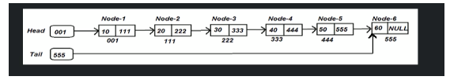
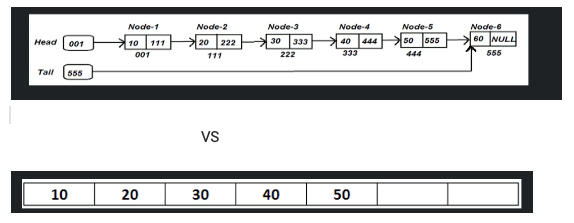
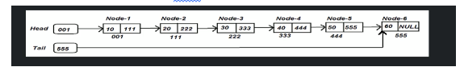
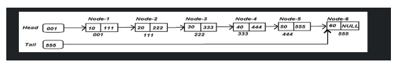
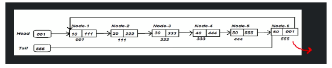
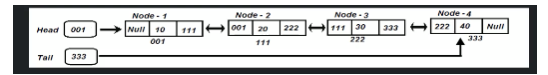
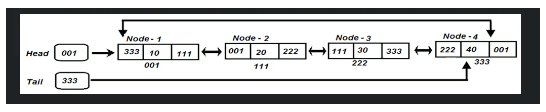
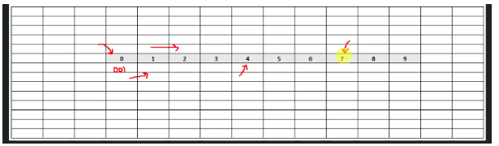
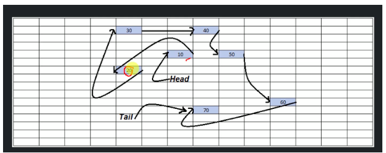

<h2> Linked list :</h2> 
Is a linear data structure where each element is a separate object. Each element(also known as `NODE`) of a list comprises of 
two items:

- Data
- And the address of the next node.

  
<b><u>NOTE :</u> Powerful feature of linked lists is that it is variable in size.</b>

  
<h3>Lets understand linked list using a Train example:</h3>
 

  
<b> Now there are couple of things we have to notice here in the train: </b>

- In this train we have one engine, 4 compartments and 1 guard room.
- Train always starts with an engine. It can never starts with guard room or compartments
- Guard room is always at the end of the train
- All the compartments, engine, gurad room are join with coupler
- In the compartment we have seats and those seats are reserved by the passengers.
- All the compartments are independent, that means if we dont need any compartment we can remove any compartment at any time, similarly we can add any compartment    
  in any place in the train.What it means is that the compartments are individual separate entities and the existence of train does not depend on this compartment.
- We can enter in the compartment in a sequence manner what that mean is let say we have to go to compartment 3 so we cannot jump directly to the compartment we  
  have to first enter engine and from their we have to enter compartment 2 and then compartment 3 and so on.

 

Linked list is similar to this train and has the same properties.it always start from the first element and their will be last element in the linked list.
Each linked list has data (passengers in the compartment) and  reference is nothing but the couplers. 
Linked list is a variable in size that means u can insert or remove an element or node anytime from the linked list.

<b>E.g. of Linked list</b>

 

  

<b>Linked list vs Array:</b>

 

<b>Separate Object: </b>In Linked list each element or node is a separate or independent object but in case of Array the elements are not independent in fact the entire array is one object. What it means is let's say we have to insert or delete any elements or nodes from linked list then we can do that but the same is not possible in the case of Array.We cannot delete the cell in Array we can update the value in array
Variable size : in  Linked list the number of nodes are not defined we can insert and delete the nodes in linked list but in array we have to provide the size of the array before creating an array.
Random access : In linked list we cannot access the node randomly or directly if we have to access any node in between then we have to start from the beginning and have to traverse to the node. In array we can access the element easily or directly. This is one of the biggest limitation in Linked List.

Component Of Linked List:
Node: contains the data and reference to the next node.
Head: is the first component or node in the list. Here in head we store the value 001 indicating that the first node is residing in this address in memory. 
The reason we need head is coz with the help of head  we know where the linked list is store and we can access the linked list.

 

 

Tail : reference to the last node in the linked list. In this case we see 555 is the last address and therefore tail store the value 555. 
Now the reason we need tail is because if we don’t have the tail and we have to add an element in the address then to get the address value i.e. 555 we have to go from the beginning till the second last node to get the address value i.e. 555 and then we can add the last node.
But using tail we can get the value from there.

 
<h3> Types Of Linked List:</h3>
Following are the types of linked list:

- Single Linked List:is the linked list which consists of data and the address to the next node. It does not contain the address of the previous node. Also the last cell consists of the  data and address as NULL.

 

  
		

- Circular Single Linked List : is the linked list similar to single linked list which consists of data and the address to the next node. It does not contain the address of the previous node. The only difference is the last cell consists of the  data and address of the first cell.

 

  

- Double linked List : is the linked list which consists of data and the address to the previous and next node. Also the last cell consists of the  data and address as NULL.

 

  

- Circular Double linked List : is the linked list which is similar to double linked and consists of data and the address to the previous and next node. Also the last cell consists of the  data and address of the first cell.

 

  

<h3> Why do we need so many Linked List:</h3>

	Single Linked list can be used in many scenarios but there are certain cases where a single linked list wort work.
	
	1). Let's say we want to traverse through all the cells and once it reaches the end it starts from the beginning. In this case circular linked list works.
	     In case : where we have to implement ALT+ Tab where it will traverse through all applications in mac or windows

	2). Similarly we want to traverse forward and backward on both sides like a Music playlist. We cannot do it using a Single Linked List and therefore Double 		Linked List came in the picture.

	In case : where we have to implement a music player.

	3) In cases where we have to implement ALT+ TAB in mac or windows to traverse through one app to another app and also to its previous tab.

<h3>How Linked List is store in memory:</h3>

	Lets see again how array is stored in memory:
	Let's say we have an array and the size is 10 so it will store in the memory and take 10 consecutive  cells and the compiler takes the address of the first 	    cell and stores it in the reference variable. Let's say the address value of first cell is 0001 so compiler knows the address of the next 10 cells as they 	       are consecutive and there in Array we can directly go to any address and that's one of the biggest advantage of Array. 

 

  

	Now let’s see how linked is stored in memory:
	As you see Linked list does not store the value in continuous and that’s the reason why liked linked cannot go to a cell directly and have to traverse in 	  sequence. 

	But the advantage of storing the linked list like this is that we can insert or remove the cells at any point and that is one of the biggest advantages of 	   linked list that we dont have to provide the size of the linked list before creation.
	
 

  
