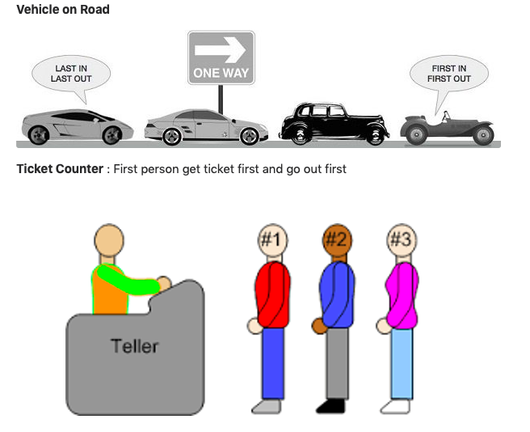
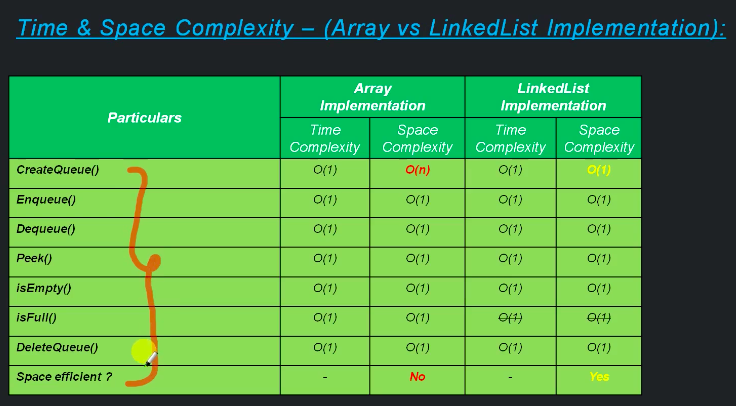

<h2> Queue </h2>

Queue is a linear data structure that follows the concept of <b>FIFO (First in first out)</b>.

Queue is same like a real world queue where u have group of people, numbers , elements etc are there and the  one enter first in the queue be the one who will
be out first.

  
<h3> Queue in real world example </h3>

In the queue you can only enter from the last. One cannot enter from first or in between.

It is implemeneted using the Physical data strture (like Stack) i.e.

- Array
- Linked List

 
<h3> Operations in Queue </h3>

- createQueue
- enQueue (insert)
- deQueue (remove)
- peekInQueue (get Queue data)
- isFull  ------------------ only implemented in Arrays and is not applicable in Linked List
- isEmpty
- deleteQueue

 
<h3> Types of Queue </h3>

- Linear Queue : Linear queue can be implemented by Arrays and Linked List both
- Circular Queue : Circular queue can only be implemented by Arrays

 
<h2>Queue Operations VIA Arrays Algo :</h2>

1. createQueue(size):
    - create queue (array) based on size. `int[] queue = new int[size]`
    - set `beginingQueue == -1`
    - set `endQueue == -1`
    
 
 2. isEmpty
    - check if `endQueue == -1 && beginingQueue == -1` return true else false
 
 
 3. isFull
    - check if `endQueue == array.length` return true else false
    
 4. deleteQueue
    - make array as null  `queue =  null`
          
                                                         
 5. enQueue(data):
    - if the queue is Full that means `endQueue ==  array.length`  exit from method
    - if the queue is empty than  beginingQueue and endQueue both are -1 
         -  point `beginingQueue == endQueue + 1` 
         -  point `endqueue ==  endQueue + 1` 
    -  else
         insert in queue :  `queue[endQueue + 1] = data`;
         point `endqueue == endQueue + 1` 
                        

 6. deQueue():
    - if the queue is empty that means `endQueue == -1 && beginingQueue == -1`  exit from method
    - else if beginingQueue !=  endQueue then  `beginingQueue =  beginingQueue  + 1`;
    - else if beginingQueue ==  endQueue  then `endQueue == -1 && beginingQueue == -1`
 
 7. peekInQueue ()
    - if the queue is empty that means `endQueue == -1 && beginingQueue == -1`  exit from method
    - else  `return queue[beginingQueue]`;
 
 
 
   
 <h2>Circular Queue</h2>
 Before we define what is circular queue  lets understand one scenario:
 
 Assume we have a normal queue array of size 5. 
 
 [2][3][1][4][9] - here we have 5 elements and the  `beginingQueue is pointing to [2]` and  `endQueue is pointing to [9]` 
                   
 Now if we call isFull() it will return true.
 
  
 
Now we will invoke dequeue  it will return  
    
    [][3][1][4][9] 
    
 and if we call dequeue it will return  
 
    [][][1][4][9] 
 <b>If we again call isFull it will return true which logically is not correct coz we have two empty cells</b>

 
  
 Now to fix this kind of issue we have a concept of </b>Circular Queue.</b>
 
  
 Ciricular queue has some diffenent concepts for few of it operations.

     1.createQueue() - same like Queue nothing change
     2.isEmpty - same like queue nothing change
     3.deleteQueue - same like queue nothing change
     4.peekInQueue - same like queue nothing change
     5.isFull - here the cncept is change let see :
              
              Algo:
              - check if `(endQueue + 1) % N == beginingQueue` return true else false ----> Here N represents the 
                size of an array      
         
              lets see : 
              here we way array of 5 that has only 3 element and the `endQueue is pointing to 5th element i.e. [9]` 
              and `beginingQueue pointing to 2nd element i.e.[1]`
          
              [][][1][4][9] 

               now lets see if it full or not by using the formuale used above `(endQueue + 1) % N == beginingQueue`
                => (4 + 1) % 5 == 2
                => 5 % 5 == 2
                => 0 == 2  =>  Queue is not Full 
                
                Again lets see with another example this time we have added one element in array, this time the 
                beginingQueue is pointing to the 1st cell [][2][1][4][9] 
                
                => (4 + 1) % 5 == 1
                => 5 % 5 == 1
                => 0 == 1  =>  Queue is not Full 
                
               One last example: this time we have all the elements in array full with data, this time the beginingQueue 
               is pointing to the 0th cell [6][2][1][4][9]
               
                => (4 + 1) % 5 == 0
                => 5 % 5 == 0
                => 0 == 0     =>  Queue is Full 

     6.enQueue (insert) -  here the concept is also slightly change, lets see:
     
                Algo:
                - if the queue is Full that means `(endQueue + 1) % N == beginingQueue`  exit from method  ----> this is 
                  same
                - if the queue is empty than  beginingQueue and endQueue both are -1  ----> this is same
                    -  point `beginingQueue == endQueue + 1` (i.e. 0)
                    -  point `endqueue ==  endQueue + 1` (i.e. 0)
                -  else
                        -  insert in queue :  `queue[(endQueue + 1) % N]  = data`;
                        -  point `endqueue == [endQueue + 1] % N` 
     
              lets see with the same example: 
              here we way array of 5 that has only 3 element and the `endQueue is pointing to 5th element i.e. [9]` and 
              `beginingQueue pointing to 2nd element i.e.[1]`
          
              [][][1][4][9]
              
              now we will enque one record i.e. 45
              
                -> so it will go to first condition if queue is full it is not here queue is not full so it will skip this 
                   condition also 
                -> then it will check it it is empty queue here queue is not empty so it will skip this condition also
                -> it will insert a record in queue based on the following formulae:
                    - `queue[(endQueue + 1) % N]  = data`
                    => queue[(4 + 1) % 5]  = 45
                    => lets calculate the inner formulae i.e (endQueue + 1) % N , here endqueue is pointing to cell 4 and 
                       N =  total size of array
                    => (endQueue + 1) % N =>  (4 + 1) % 5
                    =>  (4 + 1) % 5 =>  5 % 5 = 0
                    => queue[0] = 45
     
     
     7.deQueue (remove) : here dequeue also has slightly concept, lets see
     
                - if the queue is empty that means `endQueue == -1 && beginingQueue == -1`  exit from method -- it is 
                  same and nothing to change
                - else if beginingQueue ==  endQueue  then `endQueue ==  && beginingQueue == -1`-- it is same and 
                  nothing to change
                - else if beginingQueue !=  endQueue then  `beginingQueue =  (beginingQueue + 1) % N`;
                
                
                Lets check the dequeue funtionality, here we will take the same example:
                    
                [][][1][4][3]
                
                now we will invoke deque it will go to the code and check :
                - if the queue is empty no it is not so it will skip this condition
                - if beginingQueue ==  endQueue here beginingQueue is pointing to cell 2 and endqueue is pointing to cell
                  4 so it will skip this condition
                - if beginingQueue !=  endQueue this condition is true as beginingQueue is pointing to cell 2 and endqueue
                   is pointing to cell 4 and they are not equal so it will deque the element based on the formulae:
                
                beginingQueue =  (beginingQueue + 1) % N
                => beginingQueue = (2 + 1) % 5
                                 = 3 % 5 
                                 = 3 (3 % 5 = 3 and not 0 or 0.6 why lets see 
                                     if the operation is 12 % 5 then 5 * 2 = 10 which is smaller than 12 and 5 * 3 = 15 so 
                                     we will take 5 * 2 = 10
                                     so 12  - 10 = 2 
                                     similarly for any first digit smaller than the second digit it will multiply by 0 so 
                                     in this case it will be
                                     
                                     => 3 % 5
                                     => 3 - (5 * 0)
                                     => 3  - 0
                                     => 3
                                 
  
  
    
  <h2>Queue via Linked List</h2>
  
 In this we are going to implement queue using linked list. It has the same operations covered in arrays.
 Now before we see the psuedocode to implement those operations we need to understand what are the advantages/disadvantages we are getting using Linked List.
 
        Now when we implement with array let see what are the advantages or disadvantages we will get:
        
        say we have a queue like this
        [23][5][1][4][3] --->  that is the queue is full
        
        1. Now there is a disadvntage and that is if we want to enque element in a queue then :
            a. either we will say queue is full coz array size cannot be increased or
            b. create another array with extra size and then copy the entire array and place in this new array(with extra 
               size). But the problem with that is that copy and adding the records in new array is expensive as the Time 
               complexity it will take is O(n). Thats why  Linked list has an advantage over it.
            
        2.Now lets take another example :
          [23][][][][][][][][][][][][]  - array with only one element.
          
          Now the problem with such kind of array is that it is unnecessary taking extra space or memory and thats why 
          Linked list has an advantage over it.
            
        
      3. Lets take another array  [23][5][1][4][3][]
       
       now the advantage of array over linked list is in case i want to search for any cell I dont have to traverse from 
       the start like in the case of linked list we can easily search/pick the array as we know the stating point/address 
       and the last address of the array. 
       
       This is not easy in Linked List and to get any element other than first element one has to :
       
       a. either traverse from one element to another element till we get the desired element. Now the problem with such 
       kind of traversing is that it is costly as the time complexity for traversing is O(n).
       
       b. there is other way also where you define the logic in such a manner that the search will be order of constant 
       (O(1)) instead of O(n).
        
 
    
 
<h2>Lets see the algo of Queue via Linked List:</h2>

<b>Note: We dont have a concept of Circular Queue in List as we can add as many element in the queue using linked list also when we deque the position will point to the next element.</b>

Here we will create a node that has:
a. data ->  data to save.
b. next --> pointing to the address of next node

 
Now when you create a node it will have:

- head node  -  beginingQueue
- tail node - endQueue
- size - number of nodes or data added
        
1. createQueue(size):
    - `create a head node`
    - `tail point to head`
    - `size ++`
    
 
 2. isEmpty
    - if `head ==  null && tail == null` it is empty

    
 3. deleteQueue
    - make `head = null , tail = null and size = 0`
          
                                                         
 4. enQueue(data):
    - if the queue is Empty call create method 
    -  else
         - create a new node for that data
         - tail address should point to the new node
         - now tail should be pointing to new node
         - size ++; 
         
         Lets take an example here we have a following node
         
         head --> 2|100     76|150      55|200      43|null   <--------tail          
         
         now we have to enqueue data 25 
         so we will:
         - check if node is empty , no it is not so it will skip
         - next it will create a node - 25|null (lets say address of this node is 250)
         - next tail address i.e. 43|null (null) should point to this address(250) so after calling this step it will become :
             head --> 2|100     76|150      55|200      43|250 (<--tail)    25|null
         - now tail should be pointing to new node i.e. 
          head --> 2|100     76|150      55|200      43|250     25|null  <--------------tail
         - size = current size + 1
         
         
 5. deQueue():
    - if the queue is empty exit from method or throw an exception
    - else create a temp node pointing to head node
    - make head = null
    - next head node address should point temp.next i.e. next node address
    - check if head afyter pointing to temp.next i.e. next node address i equal to null that means head is currently in the last node and a deque operation is 
    invoked then it that case head = temp.next (temp.next is null) so head = null.
    If head is equal to null then make tail = null
    -   size = current size - 1
    
 
 
 6. peekInQueue ()
    - if the queue is empty that means `head ==  null && tail == null`  exit from method or throw an exception
    - else  `return head.data`;
 
 
 
 
     
 
 <h2>Time Complexity of Queue via Linked List or Array</h2>
 
  
 
  

 
 
