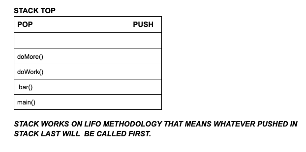

# Data structures:
this repository is all about data structures.

# What is Data structures
DS is a way to 'organize data' in a way that enables it to be processed in an effiient time.

# Types of Data Structures:

                                                Data Structure
                                                      |
                                                      |
                                                      |
                    --------------------------------------------------------------------------------
                    |                                                                               |
                    |                                                                               |
             Primitive Data Structure                                                   Non Primitive Data Structure 
       (provided by programming language)                                                           |    
                    |                                                                               |
                    |                                                                               |
      ---------------------------------------                                                       |
      |             |            |          |                                                       |                                                                              
      Float       Integer     Character   Boolean                           -----------------------------------------                                      
                                                                            |                                       |  
                                                                         Physical DS                            Logical DS
                                                            (are the one that are implemented         (are logical in nature
                                                              standalone and are physically             i.e. they have their 
                                                                  present in RAM).                        own concpept but                                                  
                                                                 |                            when it comes to implementation  
                                                                 |                         they are dependent on Physical DS.) 
                                                                 |                                          |
                                                        -------------------               -----------------------------------
                                                        |                 |               |           |            |        |
                                                     Array            LinkedList        Stack       Queue         Tree   Graph
                                                     
                                         
                                      
Logical Data structure are dependent on Physical DS for their implementation as they have their own concept that means the 
way to do the calculation but when it comes to implementation they are completely dependent o Physical DS. 

Lets say you want to implement stack so it will either use Array or Linled List for the implementation same goes for 
other Logical DS.

# Recursion : Calling Yourself
  Imagine leaving a building that has a revolving door. Instead of exiting the building, you keep going around and around        
  again, until someone tells you to exit (or you pass out from dizziness). In programming, a recursive method is like this: it   
  calls itself over and over until something triggers its exit.

  You may see possible issues with this right away. The danger is that the method will repeat itself until the program  
  crashes.                                       
                                         
# Properties of Recursion:
  - Same operation is performed multiple times with different input.
  - In every step we try to make the problem smaller.
  - We mandatorily need to have a base condition which tells when to stop the recursion.                                         
                                         
# Why should we learn Recursion:
  - Because it makes the code easy to read & write (compared to iterative) whenever a given problem can be broken down into               
    similar sub-problem.
  - Because it is heavily used in Data structures like Tree and Graph.
  - It is heavily used in techniques like "Divide and Conquer", "Greedy", Dynamic Programming.                                          
                                                        
# Format of a recursive function or method:
  - Recursive case: Case where the function recur
  - Base case: Case where the function does not recur.

    # Example Of Recursion method (Format):

        SampleRecursion(parameter){
          if(base case is satisfied){
            return some base case value    
          }else {
             SampleRecursion(modified parameter)
          }
        } 
                                                        
   # How Recursion works internally :

    Basically here we will understand how the Recursion method is managed in STACK.

    Normally in non-recursive method if we have a method like:

        main(){
          bar();
         System.out.println("inside main");
        }

      bar(){
         doWork();
         System.out.println("inside bar");
      }
      doWork(){
          doMore();
          System.out.println("inside doWork");
      } 

      doMore(){
        System.out.println("inside doMore");
        }

# Stack Image of non-recursive method :

 
      
 So how does it work internaly in this case:
 
    1. Jvm calls the main() method and notice that the main() method is calling bar() method so it will push the main method 
       in the stack and once the bar method process completes then it will invoke the next line in the main method i.e. 
       "System.out.println("inside main");" and so on..
    2. then jvm will invoke the bar method and notice that it is calling the doWork() method so it will push the bar() 
       method in the stack and once the doWork method process completes then it will invoke the next line in the bar method    
       i.e.  "System.out.println("inside bar");".
    3. Similarly jvm will invoke the doWork method and notice that it is calling the doMore() method so it will push the    
       doWork() method in the stack and once the doMore method process completes then it will invoke the next line in the 
       doWork method  i.e.  "System.out.println("inside doWork");".
    4. Next jvm will invoke the doMore method and print "inside doMore" - "System.out.println("inside doMore");".
  
  output: u
          
          inside doMore
          inside doWork
          inside bar
          inside main
  
 # In case of Recursive method:
 
    main(){
      foo(3);
    }
    
    foo(n){
      if(n < 1){
        return n;
       }
       else{
          foo(n-1);
          System.out.println("The number is : " + n);
        }
    
  # Stack Image for recursive method :

      Pop       Push

      foo(1)
      foo(2)
      foo(3)
      main()    
      
 
 
 #Here is another example that will display the code as well how JVM arrange the recursion method call in stack:
 
 
 
  
 
 
 
 
 
 
 
 
 
 
 
 
 
 
                                                        
                                                                                  
