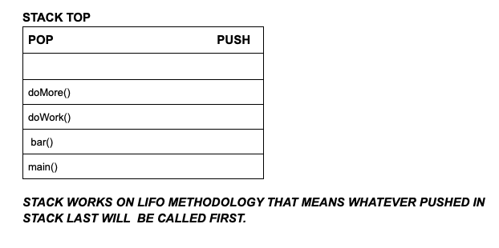
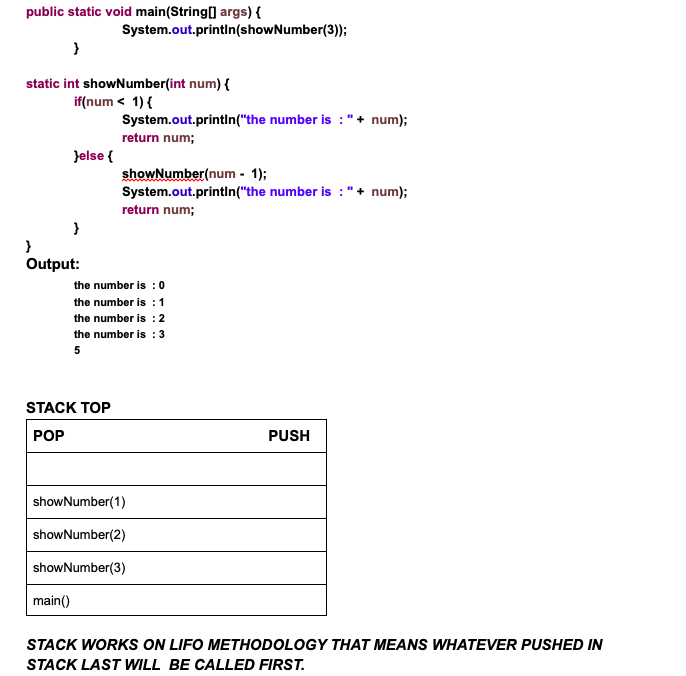

# DS - Section 1: RECURSION

  
<h2>Recursion : Calling Yourself</h2>
  Imagine leaving a building that has a revolving door. Instead of exiting the building, you keep going around and around        
  again, until someone tells you to exit (or you pass out from dizziness). In programming, a recursive method is like this: it   
  calls itself over and over until something triggers its exit.

  You may see possible issues with this right away. The danger is that the method will repeat itself until the program  
  crashes.                                       
                                         
<h2>Properties of Recursion:</h2>

    - Same operation is performed multiple times with different input.
    - In every step we try to make the problem smaller.
    - We mandatorily need to have a base condition which tells when to stop the recursion.                                         
                                         
<h2>Why should we learn Recursion:</h2>
  
    - Because it makes the code easy to read & write (compared to iterative) whenever a given problem can be broken down into               
      similar sub-problem.
    - Because it is heavily used in Data structures like Tree and Graph.
    - It is heavily used in techniques like "Divide and Conquer", "Greedy", Dynamic Programming.                                          
                                                        
<h2>Format of a recursive function or method:</h2>
    
    - Recursive case: Case where the function recur
    - Base case: Case where the function does not recur.

    <h3>Example Of Recursion method (Format):<h3>

        SampleRecursion(parameter){
          if(base case is satisfied){
            return some base case value    
          }else {
             SampleRecursion(modified parameter)
          }
        } 
                                                        
   <h2>How Recursion works internally :</h2>

    Basically here we will understand how the Recursion method is managed in STACK.

    Normally in non-recursive method if we have a method like:

        main(){
          bar();
         System.out.println("inside main");
        }

      bar(){
         doWork();
         System.out.println("inside bar");
      }
      doWork(){
          doMore();
          System.out.println("inside doWork");
      } 

      doMore(){
        System.out.println("inside doMore");
        }

<h3>Stack Image of non-recursive method :</h3>
 

      
<b>So how does it work internaly in this case:</b>
 
    1. Jvm calls the main() method and notice that the main() method is calling bar() method so it will push the main method 
       in the stack and once the bar method process completes then it will invoke the next line in the main method i.e. 
       "System.out.println("inside main");" and so on..
    2. then jvm will invoke the bar method and notice that it is calling the doWork() method so it will push the bar() 
       method in the stack and once the doWork method process completes then it will invoke the next line in the bar method    
       i.e.  "System.out.println("inside bar");".
    3. Similarly jvm will invoke the doWork method and notice that it is calling the doMore() method so it will push the    
       doWork() method in the stack and once the doMore method process completes then it will invoke the next line in the 
       doWork method  i.e.  "System.out.println("inside doWork");".
    4. Next jvm will invoke the doMore method and print "inside doMore" - "System.out.println("inside doMore");".
  
  <h3>output: </h3>
          
          inside doMore
          inside doWork
          inside bar
          inside main
  
 <h2> In case of Recursive method:</h2>
 
    main(){
      foo(3);
    }
    
    foo(n){
      if(n < 1){
        return n;
       }
       else{
          foo(n-1);
          System.out.println("The number is : " + n);
        }
    
  <h3>Stack Image for recursive method :</h3>

      Pop       Push

      foo(1)
      foo(2)
      foo(3)
      main()    
      
 

<h2> Here is another example that will display the code as well how JVM arrange the recursion method call in stack: <h2>
 
  
 
  
 
 
 <h3> How recursive method works internally and things to remember</h3>
  
      1. Jvm calls the main() method first and notice that the main() method is calling showNumber() method 
         so it will push the main method in the stack.
      2. then jvm will invoke the showNumber(3) and noticed that it has a base condition that if the number is less than 1 
         i.e. 0 then return the value of num variable else call the recusive condition by calling the  showNumber(n-1) i.e.  
         method showNumber(2) recursively so it will push the showNumber(3) in stack and complete the rest of the statement 
         once it will invoke showNumber(2) completely.
      3. Now jvm invoke the showNumber(2) and similary showNumber(1) till the time the value is not less that 1 i.e. 0, once     
         the value = 0 it will not execute the return statement coz if it did then it will come out of the method and it will 
         not be able to execute the statement of rest of the showNumber() methods like showNumber(3), showNumber(2) and 
         showNumber(1).
         So what it will first call the statement that is present in the if condition when num == 0 and if it finds the return 
         statement then instead of calling the return statement it will go to the showNumber(1) in else statemnt and call the 
         next statement i.e System.out.println("the number is  : " +  num), similary it will do the same for showNumber(2) and     
         showNumber(3) and then call the return statment present in the else loop therefore the "return num" will give the 
         value of 3 and not 0 as when the return statement was invoked the value of num is 3 and not zero.
         
<b><i>`"Point 3(above) is somewhat confusing but is logical and very important to understand about recursive methods"`</i>   </b>
 
