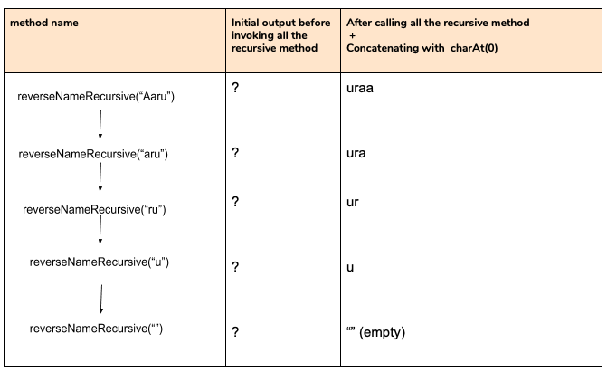
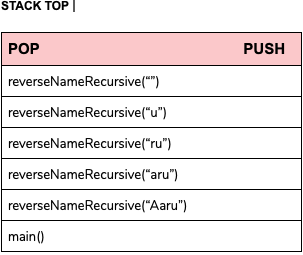

# Name Reversal
this method is to reverse the given name as part of the parameter.

 for e.g. the input is "SURUCHI" so the output we are looking is the reversal of the name - "IHCURUS"

 
<h3> Here is the code snippet </h3>

    private static String reverseNameRecursive(String theName){
        if(theName.length() == 0) {
          return "please provide a logical name;
        }
        return (reverseNameRecursive(theName.substring(1)) + theName.charAt(0)) ;
      }
 
  
 <h3>The above code we can also write like this to get a better understanding of what exactly is happening:</h3>
 
     private static String reverseNameRecursive(String theName){
        String name = null;
        if(theName.length() == 0) {
          return theName;
        }
         name =  reverseNameRecursive(theName.substring(1));
         String output =  name + theName.charAt(0);

         return output;
      }

 
 <b>Lets assume we are providing input "Aaru" as the name.</b>
 
     - Now what we are doing here is we are first checking if theName.length == 0 the name length of  Aaru is 4 which is 
     definitely greater than 0 so it will skip the if case and go to the code at line 20 i.e.
     name =  reverseNameRecursive(theName.substring(1));
     So reverseNameRecursive("Aaru") is calling the recursive method reverseNameRecursive("aru") with value "aru" 
     ("Aaru".substring(1)) so jvm will keep the method `reverseNameRecursive("Aaru")` in stack.

    - Now since we dont know the value of reverseNameRecursive("aru") so it is going to call method and first check if the 
    lenght ==0 since the length is greater than 0 it will then go to the next step and call the recursive method 
    reverseNameRecursive("ru"). Jvm will keep `reverseNameRecursive("aru")` in stack.

    - reverseNameRecursive("ru") will do the same process i.e. checking the length in this case also the value is greater than 0
    so it will call recursive method again and calls reverseNameRecursive("u"). Jvm will keep the method in  
    `reverseNameRecursive("ru")` in stack.

    - reverseNameRecursive("u") will again check the length first and since it is greater than zero calls the 
    `reverseNameRecursive("")`. Jvm will keep reverseNameRecursive("u") method in stack.

    - Now reverseNameRecursive("") is called and it will check the lenght of the input this time the input ==0 so it will return
    output as `theName i.e. empty`

 
<b>Now if we go through the below diagram we will understand how we got out output:</b>

  
<b> Here is how the stack will look : </b>

 
 
  
