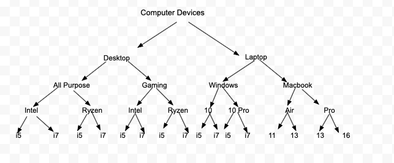
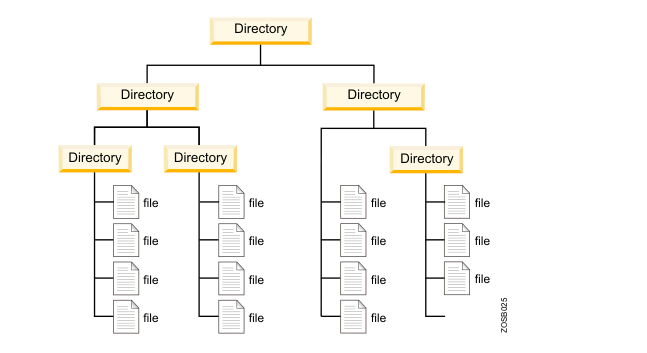

<h2> Tree </h2>

We use Tree Data structure in our day to day life. There are so many examples where we use tree data structure.
Lets see oe of the example here: 

<b> Let's say we are planning to buy a Computer device for mailing.. </b>
  

 

OR another example is of folder structure in computer

  
<b>Tree: </b>  

- In computer science, a tree is a widely used abstract data type that simulates a hierarchical tree structure, with a root value and subtrees of children with a   
  parent node, represented as a set of linked nodes.
- A tree is a nonlinear data structure, compared to arrays, linked lists, stacks and queues which are linear data structures. 
- A tree can be empty with no nodes or a tree is a structure consisting of one root and zero or one or more subtrees.

   
<b>Properties of tree: </b>

- Represents data in hierachicalform 
- Each node consist of 2 elements (Data and reference of subtree node)
- It has a root node and 2 subtree called left tree and right tree
