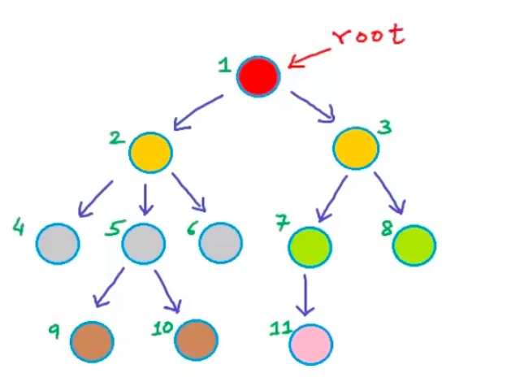

<h2> Tree </h2>

 Till now we have looked into Linear Datastructure that is Datastructre in which data are stored in a sequential manner, it has logical start and a logical end, and each data has a previous or next element.

Linear Data structure are:

- Array
- Linked List
- Stack
- Queue

Now we will look into a different datastructure called <b> `Tree` </b>.

We use Tree Data structure in our day to day life. There are so many examples where we use tree data structure.
Lets see oe of the example here: 

<b> Let's say we are planning to buy a Computer device for mailing.. </b>
  

 

OR another example is of folder structure in computer

  
Some more examples of tree:

 

<b>Tree: </b>  

- In computer science, a tree is a widely used abstract data type that simulates a hierarchical tree structure, with a root value and subtrees of children with a   
  parent node, represented as a set of linked nodes.
- A tree is a nonlinear data structure, compared to arrays, linked lists, stacks and queues which are linear data structures. 
- A tree can be empty with no nodes or a tree is a structure consisting of one root and zero or one or more subtrees.

   
<b>Properties of tree: </b>

- Represents data in hierachicalform 
- Each node consist of 2 elements (Data and reference of subtree node)
- It has a root node and 2 subtree called left tree and right tree

  
<h3>Need of Tree in Data structure</h3>

IS Array or Linked List not sufficient for data stucture ?
 

 Why do we need a tree and what advantage it will give that the other data structure specially Array and Linked List does not have. To understand this lets see the time complexity and the space complecity of Array and Linked List : 

 

 

In array, If you notice the space efficiency is not good i.e once you created an array you cannot increase the array. For that you have to create a new array with extra space and copy the current array and place it in the new array which is a very costly operation.

 Similarly in Linked List some of the operations like insertion, deletion, searching, traversing is a costly operation (Time Complexity is O(n))
 
  
  
Because of these issue we need a data structure that is time efficient and therefore we will see how Tree will address these issues.

<h3> Terminologies in Tree </h3>

<b>Before we get into tree and see some examples, we need to understand some important technologies in Tree. Let's understand does terminologies.</b>

Here we used an empty tree as an example to understand the terminologies.

 

 

- <b><i>Node:</i></b> a tree consists of one or more than one node/nodes. Each node consist of data of any type String, char, number etc. and the address reference of the next node (left and right both).

 

 
  
 
 - <b><i>root:</i></b> is a node that does not have a parent

 

 

- <b><i>leaf:</i></b> is a node does not has a child. In the below example all the nodes that are leaf are marked in black color.

 

 

- <b><i>link or edge :</i></b> each node is connected to other nodes using lik or edge. The arrows refer in the trees are nothing but link also known as edges.

 In tree we have N(muliple) nodes. `And each node has N - 1 edges`. That means 1 edge of a parent and N nodes for children. 
For eg. for node 5 has one edge of node 2(parent node) and two edges of 9 and 10 (children)

 

 

- <b><i>parent:</i></b> is a node that has children. Here in the above example root or 1 is the parent of 2 and 3. Similarly 2 is  the parent of 4,5, 6 node and 3 is the parent of node 7 and 8 an so on..

 

 

- <b><i>children:</i></b> is a node that are part of the nodes or has parent. In this example 2 and 3 is the parent of root. 4,5,6 is the children of 2 and so on..

 

 

- <b><i>sibling:</i></b> are nodes that are part of same parent. Like 2 and 3 are siblings as they are sharing the same parent i.e. node 1.

 

- <b><i>ancestors:</i></b> is node that is parent, grand parent, great grand parent of a particular node. For node 4 -  node 2  is the parent and node 1 is the grand parent

 

 

- <b><i>descendent:</i></b> is a nodes that is a  child, grand child, great grand child of a particular node. For example node 4 is a descendent of 2 and 1.

 

 

- <b><i>subtree:</i></b> each tree has subtrees. If you below example we have 2 big subtrees:
  
  - left subtree represented in red color consist of nodes 2,4,5,6,9,10 
  - right subtree represented in yellow color consist of nodes 3,7,8,11
  - 1 is the root node.
  
Similarly we have some more subtrees like for node 3 we have left subtree (node 7, 11) and right subtree (node 8)
 

 
