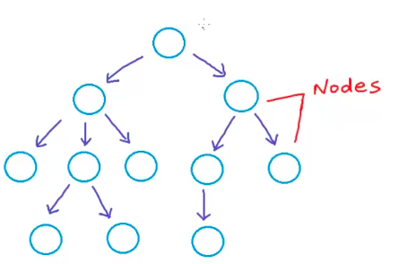

<h2> Tree </h2>

 Till now we have looked into Linear Datastructure that is Datastructre in which data are stored in a sequential manner, it has logical start and a logical end, and each data has a previous or next element.

Linear Data structure are:

- Array
- Linked List
- Stack
- Queue

Now we will look into a different datastructure called <b> `Tree` </b>.

We use Tree Data structure in our day to day life. There are so many examples where we use tree data structure.
Lets see oe of the example here: 

<b> Let's say we are planning to buy a Computer device for mailing.. </b>
  

 

OR another example is of folder structure in computer

  
Some more examples of tree:

 

<b>Tree: </b>  

- In computer science, a tree is a widely used abstract data type that simulates a hierarchical tree structure, with a root value and subtrees of children with a   
  parent node, represented as a set of linked nodes.
- A tree is a nonlinear data structure, compared to arrays, linked lists, stacks and queues which are linear data structures. 
- A tree can be empty with no nodes or a tree is a structure consisting of one root and zero or one or more subtrees.

   
<b>Properties of tree: </b>

- Represents data in hierachicalform 
- Each node consist of 2 elements (Data and reference of subtree node)
- It has a root node and 2 subtree called left tree and right tree

  
<h3>Need of Tree in Data structure</h3>

IS Array or Linked List not sufficient for data stucture ?
 

 Why do we need a tree and what advantage it will give that the other data structure specially Array and Linked List does not have. To understand this lets see the time complexity and the space complecity of Array and Linked List : 

 

 

In array, If you notice the space efficiency is not good i.e once you created an array you cannot increase the array. For that you have to create a new array with extra space and copy the current array and place it in the new array which is a very costly operation.

 Similarly in Linked List some of the operations like insertion, deletion, searching, traversing is a costly operation (Time Complexity is O(n))
 
  
  
Because of these issue we need a data structure that is time efficient and therefore we will see how Tree will address these issues.

<h3> Terminologies in Tree </h3>

<b>Before we get into tree and see some examples, we need to understand some important technologies in Tree. Let's understand does terminologies.</b>

Here we used an empty tree as an example to understand the terminologies.

 

 

- <b><i>Node:</i></b> a tree consists of one or more than one node/nodes. Each node consist of data of any type String, char, number etc. and the address reference of the next node (left and right both).

 

 
  
 
 - <b><i>root:</i></b> is a node that does not have a parent

 

 

- <b><i>leaf:</i></b> is a node does not has a child. In the below example all the nodes that are leaf are marked in black color.

 

 

- <b><i>link or edge :</i></b> each node is connected to other nodes using lik or edge. The arrows refer in the trees are nothing but link also known as edges.

 In tree we have N(muliple) nodes. `And each node has N - 1 edges`. That means 1 edge of a parent and N nodes for children. 
For eg. for node 5 has one edge of node 2(parent node) and two edges of 9 and 10 (children)

 

 

- <b><i>parent:</i></b> is a node that has children. Here in the above example root or 1 is the parent of 2 and 3. Similarly 2 is  the parent of 4,5, 6 node and 3 is the parent of node 7 and 8 an so on..

 

 

- <b><i>children:</i></b> is a node that are part of the nodes or has parent. In this example 2 and 3 is the parent of root. 4,5,6 is the children of 2 and so on..

 

 

- <b><i>sibling:</i></b> are nodes that are part of same parent. Like 2 and 3 are siblings as they are sharing the same parent i.e. node 1.

 

- <b><i>ancestors:</i></b> is node that is parent, grand parent, great grand parent of a particular node. For node 4 -  node 2  is the parent and node 1 is the grand parent

 

 

- <b><i>descendent:</i></b> is a nodes that is a  child, grand child, great grand child of a particular node. For example node 4 is a descendent of 2 and 1.

 

 

- <b><i>subtree:</i></b> each tree has subtrees. If you below example we have 2 big subtrees:
  
  - left subtree represented in red color consist of nodes 2,4,5,6,9,10 
  - right subtree represented in yellow color consist of nodes 3,7,8,11
  - 1 is the root node.
  
Similarly we have some more subtrees like for node 3 we have left subtree (node 7, 11) and right subtree (node 8)
 

 

- <b><i>Depth of node(x):</i></b> is the length from root to node x or we can also say the number of edges to root x. Let say we have to calculate the depth of node 5 then it is 2

 

- <b><i>Depth of root:</i></b> is always 0

 

 

- <b><i>Height of node(x):</i></b> is the number of edges in the longest path from node x to the the leaf.

For e.g. Height of 3 is 2 as 3 has two leaf 8 and 11 the longest path of leaf is 11. Therefore the height is 2 (due to 2 edges from 3 to 11)

 

 

- <b><i>Height of tree:</i></b> is the number of edges in the longest path from root to the the leaf.

For e.g. Height of 1 is 3  as 11 is the longest path and it has 3 edges.

 

  

<h3>Some of the applications where we use tree </h3>

- Storing data in heirarchical mannr-  like file system.
- Organize data for quick search, insertion or deletion  using Binary search trees as it uses Time complexity of O(log n)
- Special type of Tree called `Trie` used to store Dictionary, it is really fast and used for Dynamic spell checking.
- Network routing algorithm

<h2> Binary Tree</h2>

Trees that has zero, one or 2 nodes are known as Binary tree.

 
  

 

      - If you see the above diagram root has 2 children also know as left child or right child.
      - Similary root children(both) has 2 children each.
      - Node in Orange color in the extreme left has one child only that is the right child. So 
      in the code we will add the reference for the left child as `NULL`. Similarly if you notice 
     - Node in Orange color in the extreme right also has one child that is the left child so for  
      right we will add the reference in node as null.
     - All the leaf nodes in black color consist of zero node.

 there are trees that are completely vased on Binary tree like:
  
  - Binary Search Tree
  - Heap Tree
  - AVL
  - Red-Black tree
  - Syntax tree
  - Huffman Coding tree
  etc...
  
 
<b>Why to learn Trees </b>

- It is a prerequisite for other trees like BST, AVL, Heap tree etc..
- Used for solving problems like
    - Huffman coding
    - Heap(priority Queue)
    - Expression parsing
    
       
<h3> Types Of Binary Tree </h3>

- <b>Strict Binary Tree</b> : A tree in which the nodes consists of 2 children (left and right child) or none.
  
   
  

 

- <b>Full or Perfect Binary Tree</b> : A tree in which all the non leaf nodes consists of 2 nodes(right tree and left tree) and all the leaf node be at same level.
  
   
  

 

- <b>Complete Binary Tree</b> : A tree in which all the levels are filled except the last level and in the last level all the left nodes are filled.
  
   
  

 
<b>Calculating the max nodes at a level in a binary tree</b>

formulae  = level i = 2(to the power i)

Lets take the below node: in below tree  if you see there are four level
Level 0 = root
Level 1 = root children 
Level 2 = root grand children 
Level 3 = root great grand children (or last level)

so if we have to calculate the max level of tree : 
=> level i  = 2^i
=> level 3 = 2^3
=> level 3 =  8 so we have at max 8 nodes at level 3.
 
  
  

 
<b>Calculating the max number of nodes in a binary tree with height h</b>

    max number of nodes with height h  =  2^0 + 2^1 + 2^2 ...... 2 ^h
                                              OR 
                                          2^h+1 -  1    

if we take the below tree then the formulae will be:

     max number of nodes with height h  =  2^0 + 2^1 + 2^2 + 2 ^ 3 (as we have level 3)
                                        =  1 + 2 + 4 + 8
                                        =  15
     Also the same we can calculate with a simple formulae  =  2^(h+1) - 1 
                  (the max height is 3)                     =  2^(3+1)  - 1
                                                            = 2^4 - 1
                                                            = 16 - 1 
                                                            = 15
      
      `max Depth of the tree = height of the 3` 

     
 
  

    

 
<b>Calculating the height of a perfect/full binary tree with n nodes</b>

      n =  2^h+1 - 1
      => 2^h + 1  = n + 1
      => h = log2(n + 1) -1    -------------> this is the formulae
      
      now lets say in a perfect binary tree we have 15 modes and we have to calculate the height
      =>  h = log2(n + 1) -1 
      =>  h = log2(15 + 1)- 1
      =>  h = log2(16) - 1
      =>  h = 4 - 1
      =>  h = 3 is the answer
      
 
<b>Calculating the height of a complete binary tree with n nodes</b>
     
       nodes = 15
       formulae =  Math.floor(log2 n)
                = Math.floor(log2 15)
                = Math.floor(log2 15)
                = Math.floor(3.906891)
                = 3
 
 
  
<b>Balanced Binary tree</b>

 is a tree where the difference between the height of left and right subtree for every node should ot be more than 1.
  
  
    
<h3>Tree Representation </h3>

Tree can be implemented using:

- Linked List
- Array

   

<b>Tree Representation using Linked List</b> : 

Here while implementing the tree using Linked list we will :

- we will add following elements in Node
  - data - for storing data 
  - left -  pointing the reference or address of the left subtree
  - right - pointing the reference or address of the right subtree
  
 

  

<b>Tree Representation using Array</b> :  

 Tree is implemented using array if it is:
    
- Complete Binary Tree
- Heap Binary Tree

Let say we have a tree like :

 

 

Here while implementing the tree using array we will :

- first we will add the numbers to the trees starting from the root and going level to level from left to right

 

 

- let say the total number of array comes to 7 then we will create an array of size 7.

 

 
- Next we will fill the data in the array

 

 
- After filling the data in the array , how do we identify the left node and the right node. Well for that we will define the following formulae:

      for node at index i  : 
          left - child index =  cell[2*i + 1]
          right - child index = cell[2*i + 2]
          
          now to get the node at cell 1 at left subtree it will be:
          =>  cell[2 * 0 +  1]
          =  cell[0 + 1]
          = cell[1]
          
          for cell 2 at right subree:
           =>  cell[2 * 0 +  2]
            =  cell[0 + 2]
            =  cell[2]

          now for cell 3 at left subtree
          =>  cell[2*1 + 1]
          =>  cell[3]

          now for cell 4 at right subtree
          =>  cell[2*1 + 2]
          =>  cell[4]
 
  
 
<h3> Operations in Binary Tree</h3>

- create a binary tree
- delete a binary tree
- insert a data in binary tree
- remove a node from binary tree
- search a data in binary tree
- traversing a binary tree
  - preOrder Traversal
  - inOrder Traversal
  - postOrder Traversal
  - levelOrder Traversal
- Delete deepest node
- get deepest node

 

<b> Operations implemented using Linked List </b>

1. Create a binary tree : is really simple just create an object of Binary Tree. No need to insert any record.

 <b><i>pseudo code:</i></b>
  
      BinaryTree bt = new BinaryTree();
 
2. delete a binary tree: set the root or head to null
  
 <b><i>pseudo code:</i></b>
  
      root = null;
       
 
 3.  preOrder traversal :  we will use `Recurssion (recurrsion uses STACK)` for pre order traversal
 
 In pre order the way we traverse the tree is :
      
      root
      left subtree
      right subtree
  
 <b><i>pseudo code:</i></b>
  
      void preOrder(root)
      if(root is null)
        return
      else 
        print root
        preOrder(root.left)
        preOrder(root.right)
      
      
 4. inOrder traversal : again we will use `Recurssion (recurrsion uses STACK)` for inOrder traversal
 
the way we traverse the tree is :
      
      left subtree
      root
      right subtree
  
<b><i>pseudo code:</i></b>
  
      void inOrder(root)
      if(root is null)
        return
      else 
        preOrder(root.left)
        print root
        preOrder(root.right)

 

 5. postOrder traversal : again we will use `Recurssion (recurrsion uses STACK)` for postOrder traversal
 
the way we traverse the tree is :
      
      left subtree
      right subtree
      root
      
  
 <b><i>pseudo code:</i></b>
  
      void postOrder(node)
      if(node is null)
        return
      else 
        preOrder(root.left)
        print root
        preOrder(root.right)

 
 6. levelOrder traversal : we will use `QUEUE` for levelOrder traversal
 
the way we traverse the tree is :
      
      level by level that means we will start from root then look for root children from left to right then go to the left child of root and get the children of it 
      (left and then right) and so on...
      
 For e.g.
 
 let say this is a tree :
  
 
 
 
  
 
 so the way we will traverse the array is by getting the following output
 
   
  
  
  
  Now to achieve this output we have to use the queue. Let see the psudo code
  
 <b><i>pseudo code:</i></b>
  
      void levelOrder()
      if(root is null)
        return
     else
     Create Queue object -> Queue queue = new Queue();
     enqueue --> queue.add(root);  now let say u added or inserted the tree in a way that it represents like  10|20|30|40|50 so when you add 
     the same queue it is added as  10 
     
     now loop the queue and see if it is no empty
     
     create temp node pointing to queue first element  by calling  queue.deque(); -- removed 10 from queue and put it in temp node
      
     now queue is empty 
     add the children of the parent node if there are :
        
        - if temp node left != null add it in queue -  it will add 20 in the queue
        - if temp node right != null add it in queue -  it will add 30 in the queue
        
        loop it till the queue is not empty.
     
    
 
 7. insert :  inserting data in a tree. Here we will use the same logic applied for levelOrder traversal i.e. Queue. We will go level to level and find the first        
    empty subtree and insert the data in that tree.
    
  
    
 In the below tree all the levels have their left child and right child so we will create a node under 5 as the left child.
 
  
 
 
 
  
 
 <b><i>pseudo code:</i></b>
      
        void insert(data)
        BinaryNode node = new BiaryNode(data)
        if(root == null) 
          root = node;
       else{
        create Queue 
        //do the level order and see at what level the queue is empty, loop the queue
        while(!queue.IsEmpty)
             dequeue the first value from queue and place it in temp node
             now check if the left subtree is null 
                if it null then add the node in the left side
             else check the right side 
                if right subtree is null then add the node in the right side
             else
                add it in the queue both left and right subtree
        
              in the last set size ++;
 
 
  
 
 8.     search : searching  a value from tree. We will again use Queue for the search.
 
    
            <b><i>pseudo code:</i></b>
              
            first we 
 
          

